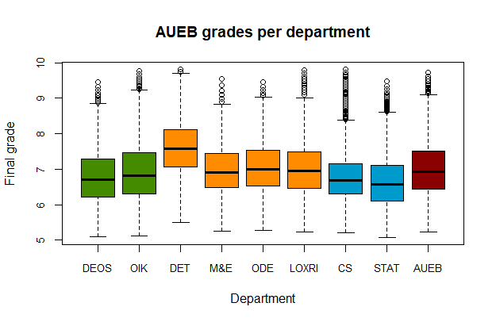

# Aueb-Statistics-Project

This is a simple analysis of data about the final grades of AUEB's graduates. 

The analysis is based on the data which can be found [here](https://www.aueb.gr/el/content/poreia-foitisis-kai-epityhies-spoydon). There's data about the grade distribution and the years it takes for students to complete their studies. There's information for each department and for each academic year from 2015-16 to 2019-20.

Firstly, we calculate the weighted average of the degree grade for each department and for AUEB as a total. Then interpolate the distribution given to us by AUEB (we are only given histogram-like values i.e. x students of department y in year z are between 7 and 7.99) and create a cdf function which takes as input a grade and a department and outputs which percentage of this department's grades are lower than the given grade. We also create an inverse cdf function that takes as input a number between 0 and 1 and a department and outputs the grade that a graduate of the given department needs to have to be above the percentage specified among other graduates of the same department. Finally, we create a boxplot of the distributions of grades for each department and for AUEB as a whole and a diagram which shows the evolution over time of the grades of selected departments and of AUEB as a total. The boxplot and the time series diagram can be seen below:

